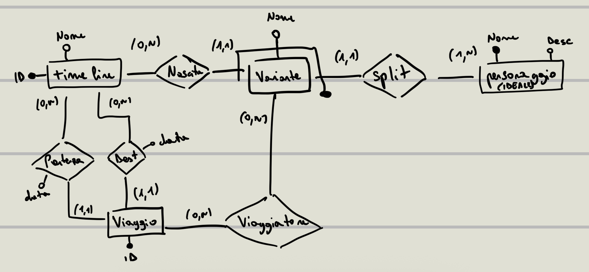

## Indice

###### Abstract
###### Requisiti
###### Schema Concettuale
###### Schema Logico


## Abstract

Si vuole creare un database per la gestione di un universo narrativo complesso, in cui i personaggi possono esistere in molteplici varianti (multiverso) e possono trovarsi in universi che non sono loro. L'obiettivo è quello di fornire agli autori uno strumento per mappare ramificazioni narrative infinite, garantendo che ogni variante di un personaggio sia coerente con la propria linea temporale d'origine e la loro posizione in universi diversi.

- TODO: gestione creazione linee temporali e legami tra di esse
- TODO: gestione eventi e loro impatto sui personaggi e sulle linee temporali


## Requisiti

Di ogni universo ci interessa: nome, descrizione.
Di ogni personaggio ci interessa: nome, descrizione.
Una variante è un personaggio che esiste in un universo specifico. 
Di ogni variante ci interessa: id, personaggio_id, universo_id.


Ci sono tanti universi identificati da un id. personaggi identificati da un nome e una descrizione.
ogni personaggio può esistere in più universi (varianti) e ogni variante è associata a un universo specifico.
ogni personaggio può viaggiare tra universi diversi.
di ogni viaggio ci interessano: data, universo di partenza, universo di arrivo, personaggio coinvolto, motivo del viaggio


## Schema concettuale



## Schema logico


- Universo (**id**, nome, descrizione)
- Personaggio (**nome**, descrizione)
- Variante (**id**, nome_variante, nome_personaggio, universo_id)
- Viaggio (**id**, universo_partenza_id, universo_arrivo_id, data_partenza,data_arrivo)
- Partecipazione (**variante_id**, **viaggio_id**)


nota: uso gli id perché altrimenti le tabelle diventano troppo grandi e portare chiavi coposte è scomodo


## Query di esempio 

```sql
-- 1. Elenca tutti i viaggi con i dettagli del personaggio, variante, universo di origine e universo di destinazione
SELECT
    V.nome_variante AS "Chi", 
    P.nome AS "Eroe Base",
    U_Origine.nome AS "Viene da", 
    U_Dest.nome AS "Atterrato in",
    Viag.data_partenza AS "Partito il",
	Viag.data_arrivo AS "Arrivato il"
FROM Partecipazione Part
JOIN Variante V ON Part.variante_id = V.id
JOIN Personaggio P ON V.personaggio_id = P.nome
JOIN Viaggio Viag ON Part.viaggio_id = Viag.id
JOIN Universo U_Origine ON V.universo_id = U_Origine.id
JOIN Universo U_Dest ON Viag.universo_arrivo_id = U_Dest.id;

-- 2. per ogni personaggio, indicare il numero di viaggi effettuati dalla sua variante che ha fatto più viaggi
CREATE VIEW viaggi_varianti AS
SELECT v.id, v.nome_variante, v.personaggio_id, COUNT(viaggio_id) num_viaggi
FROM variante v
	JOIN partecipazione p ON p.variante_id = v.id
GROUP BY v.id;

SELECT vv.personaggio_id, MAX(vv.num_viaggi)
FROM viaggi_varianti vv
	JOIN personaggio p on p.nome = vv.personaggio_id
GROUP BY vv.personaggio_id

-- 3. Elenca per ogni personaggio il numero di varianti che hanno viaggiato
SELECT p.nome, COUNT(nome_variante)
FROM personaggio p 
	JOIN variante v ON p.nome = v.personaggio_id
	JOIN partecipazione pa ON pa.variante_id = v.id
GROUP BY p.nome
ORDER BY COUNT(nome_variante) DESC;

-- 4. Elenca tutti i personaggi che hanno viaggiato in un universo specifico (es. "Universo X")
SELECT DISTINCT p.nome, p.descrizione, u.nome, u.descrizione
FROM personaggio p
    JOIN variante v ON p.nome = v.personaggio_id
    JOIN universo u ON v.universo_id = u.id
    JOIN viaggio vi ON v.universo_id = u.id
WHERE u.nome = 'Terra-65';

CREATE OR REPLACE FUNCTION get_viaggiatori_destinazione(universo_target VARCHAR)
RETURNS TABLE (
    nome_personaggio VARCHAR,
    descrizione_personaggio TEXT,
    universo_nome VARCHAR,
    universo_descrizione TEXT
) AS $$
BEGIN
    RETURN QUERY
    SELECT DISTINCT 
        p.nome, 
        p.descrizione, 
        u_dest.nome, 
        u_dest.descrizione
    FROM Personaggio p
    JOIN Variante v ON p.nome = v.personaggio_id
    JOIN Partecipazione part ON v.id = part.variante_id
    JOIN Viaggio vi ON part.viaggio_id = vi.id
    JOIN Universo u_dest ON vi.universo_arrivo_id = u_dest.id
    WHERE u_dest.nome = universo_target;
END;
$$ LANGUAGE plpgsql;

SELECT * FROM get_viaggiatori_destinazione('Terra-1610');

-- 5. Elenca tutti i personaggi che hanno viaggiato almeno una volta
SELECT DISTINCT p.nome, p.descrizione
FROM personaggio p
    JOIN variante v ON p.nome = v.personaggio_id
    JOIN partecipazione pa ON pa.variante_id = v.id
    JOIN viaggio vi ON pa.viaggio_id = vi.id
GROUP BY p.nome, p.descrizione
HAVING COUNT(pa.viaggio_id) > 0
ORDER BY p.nome;

```

ps. per esportare DB 
```bash 
# generale
pg_dump -U nome_utente -d database_name > backup_multiverso.sql
# quello che ho usato io
pg_dump -U postgres -d Timelines > backup_multiverso.sql
```# Timelines
